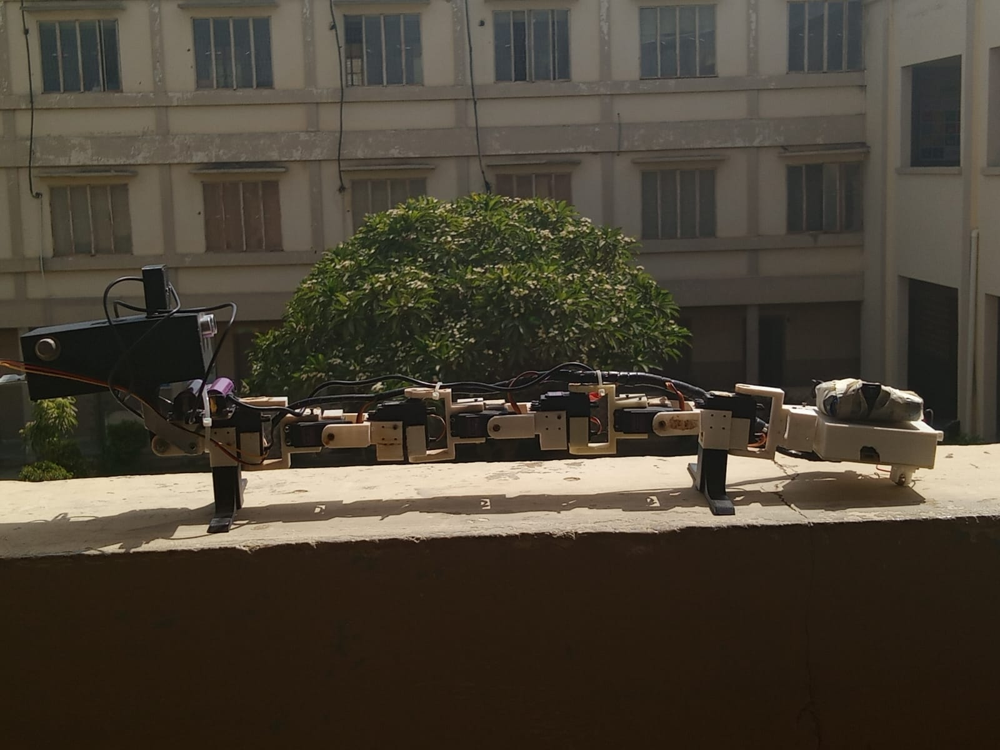
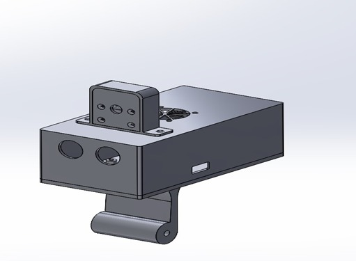
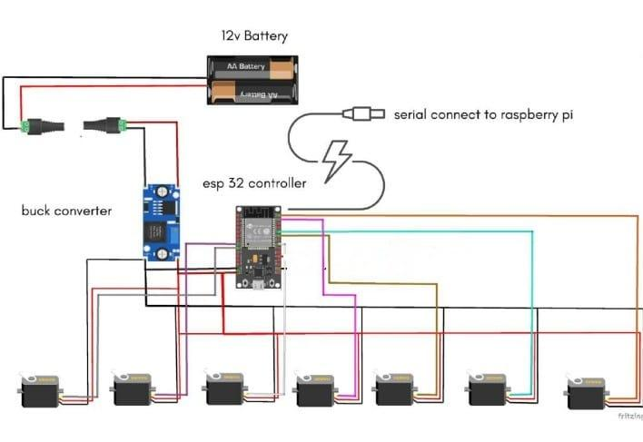
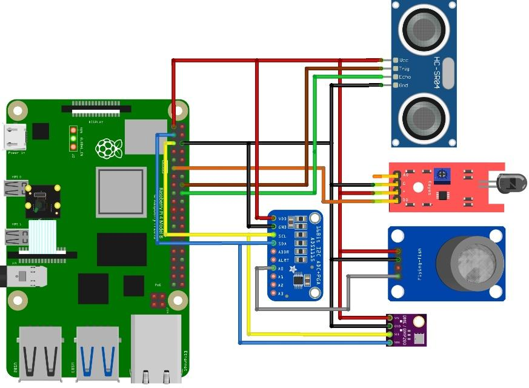

# A-Raspberry-Pi-Controlled-Snake-Robot-with-Embedded-Sensors-
A Raspberry Pi–Controlled Snake Robot with Embedded Sensors and Infrared Vision for Adaptive Environmental  Monitoring — Developed an adaptive snake robot using Raspberry Pi, environmental sensors, and infrared vision for real-time  environmental monitoring and navigation.
# Raspberry Pi Controlled Snake Robot for Adaptive Environmental Monitoring



## Overview

This project presents a Raspberry Pi and ESP32 based snake robot developed for navigation inside hazardous and confined environments where conventional wheeled robots cannot operate efficiently.

The robot integrates real-time environmental sensing, infrared night vision, wireless teleoperation, and a web-based monitoring dashboard into a compact modular robotic platform.

The system is intended for applications including:

- Search and Rescue (SAR)
- Pipeline Inspection
- Industrial Safety
- Disaster Response
- Environmental Monitoring

---

## Key Features

✔ Split-Control Architecture (Raspberry Pi + ESP32)

✔ Live Video Streaming

✔ Infrared Night Vision

✔ Web-based Control Dashboard

✔ Gas Detection (MQ2)

✔ Flame Detection

✔ Temperature Monitoring

✔ Humidity Monitoring

✔ Pressure Monitoring

✔ Ultrasonic Obstacle Detection

✔ JSON Data Logging

✔ High Torque Servo Motion

✔ Modular Snake Robot Design

---


---

## Hardware Components

| Component | Function |
|------------|-----------|
| Raspberry Pi 4 | Main Controller |
| ESP32 | Servo Controller |
| Raspberry Pi NoIR Camera | Night Vision |
| MG996R Servo Motors | Snake Motion |
| MQ2 | Gas Detection |
| BME280 | Temperature/Humidity/Pressure |
| Flame Sensor | Fire Detection |
| HC-SR04 | Obstacle Detection |
| LiPo Battery | Power Supply |

---

## Software Stack

Python

Flask

HTML

CSS

JavaScript

Arduino IDE

OpenCV

JSON

UART Communication

---
## Dashboard


The dashboard provides

- Live Camera Feed

- Motion Control

- Sensor Visualization

- Hazard Alerts

- Environmental Monitoring

# 🛠️ 3D CAD Design

The snake robot was designed using CAD software with a modular architecture that enables easy maintenance, component replacement, and future scalability. The custom-designed head houses the Raspberry Pi, Pi Camera NoIR, ultrasonic sensor, flame sensor, MQ-2 gas sensor, and BME280 sensor in a compact and lightweight enclosure.

<p align="center">
    
</p>

<p align="center">
<i>Figure 1. 3D CAD model of the snake robot head and modular body design.</i>
</p>

---

# ⚙️ ESP32 Servo Control Schematic

The ESP32 acts as the slave controller in the split-control architecture. It receives high-level motion commands from the Raspberry Pi through UART communication and generates precise PWM signals to control the MG996R servo motors.

<p align="center">
    
</p>

<p align="center">
<i>Figure 2. ESP32 wiring schematic showing servo motor connections and power distribution.</i>
</p>

### Responsibilities

- Generate hardware PWM signals
- Execute serpentine gait algorithms
- Control all MG996R servo motors
- Receive commands from Raspberry Pi
- Ensure real-time motion control

---

# 🍓 Raspberry Pi Sensor Integration Schematic

The Raspberry Pi serves as the master controller responsible for sensor acquisition, live video streaming, web dashboard hosting, and communication with the ESP32.

<p align="center">
    
</p>

<p align="center">
<i>Figure 3. Raspberry Pi sensor integration schematic.</i>
</p>

### Connected Peripherals

| Device | Interface |
|---------|-----------|
| Pi Camera V2 NoIR | CSI |
| MQ-2 Gas Sensor | GPIO |
| Flame Sensor | GPIO |
| BME280 | I²C |
| HC-SR04 Ultrasonic Sensor | GPIO |
| ESP32 | UART |

---

# 🏗️ Split-Control Architecture

The robot employs a heterogeneous split-control architecture to separate computationally intensive tasks from real-time motor control.

```
                   Wi-Fi
                     │
             Web Dashboard
                     │
             Raspberry Pi 4
                     │
             UART Communication
                     │
                  ESP32
                     │
          PWM Signals to Servos
                     │
           MG996R Servo Motors
```

### Raspberry Pi (Master)

- Live video streaming
- Flask web server
- Sensor acquisition
- Environmental monitoring
- User interface
- Command generation
- Data logging

### ESP32 (Slave)

- Servo control
- Gait generation
- Motion execution
- Real-time PWM
- Deterministic motor control

# 🔮 Future Work

- ROS 2 Integration
- Autonomous Navigation
- SLAM Mapping
- AI-Based Path Planning
- Thermal Camera Integration
- Cloud-Based Monitoring
- Predictive Hazard Analysis using Machine Learning
- Mobile Application
- GPS-Based Outdoor Navigation

---

# 👨‍💻 Team

**Muhammad Asher**
**Saad Arshad**
**Arham khan**
**Hamza Ayub**

Department of Electronic Engineering

NED University of Engineering & Technology

---


# 📜 License

This project is licensed under the MIT License.

If you find this project helpful, consider giving it a ⭐ on GitHub!
## Folder Structure
