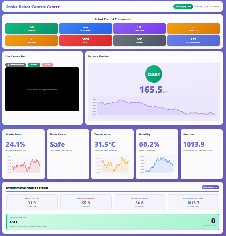

# A-Raspberry-Pi-Controlled-Snake-Robot-with-Embedded-Sensors-
A Raspberry Pi–Controlled Snake Robot with Embedded Sensors and Infrared Vision for Adaptive Environmental  Monitoring — Developed an adaptive snake robot using Raspberry Pi, environmental sensors, and infrared vision for real-time  environmental monitoring and navigation.
# Raspberry Pi Controlled Snake Robot for Adaptive Environmental Monitoring

## Overview

This project presents a Raspberry Pi and ESP32 based snake robot developed for navigation inside hazardous and confined environments where conventional wheeled robots cannot operate efficiently.

The robot integrates real-time environmental sensing, infrared night vision, wireless teleoperation, and a web-based monitoring dashboard into a compact modular robotic platform.

The system is intended for applications including:

- Search and Rescue (SAR)
- Pipeline Inspection
- Industrial Safety
- Disaster Response
- Environmental Monitoring

---

## Key Features

✔ Split-Control Architecture (Raspberry Pi + ESP32)

✔ Live Video Streaming

✔ Infrared Night Vision

✔ Web-based Control Dashboard

✔ Gas Detection (MQ2)

✔ Flame Detection

✔ Temperature Monitoring

✔ Humidity Monitoring

✔ Pressure Monitoring

✔ Ultrasonic Obstacle Detection

✔ JSON Data Logging

✔ High Torque Servo Motion

✔ Modular Snake Robot Design

---

---

## Hardware Components

| Component | Function |
|------------|-----------|
| Raspberry Pi 4 | Main Controller |
| ESP32 | Servo Controller |
| Raspberry Pi NoIR Camera | Night Vision |
| MG996R Servo Motors | Snake Motion |
| MQ2 | Gas Detection |
| BME280 | Temperature/Humidity/Pressure |
| Flame Sensor | Fire Detection |
| HC-SR04 | Obstacle Detection |
| LiPo Battery | Power Supply |

---

## Software Stack

Python

Flask

HTML

CSS

JavaScript

Arduino IDE

OpenCV

JSON

UART Communication

---
## Dashboard

The dashboard provides

- Live Camera Feed

- Motion Control

- Sensor Visualization

- Hazard Alerts

- Environmental Monitoring
## Folder Structure
